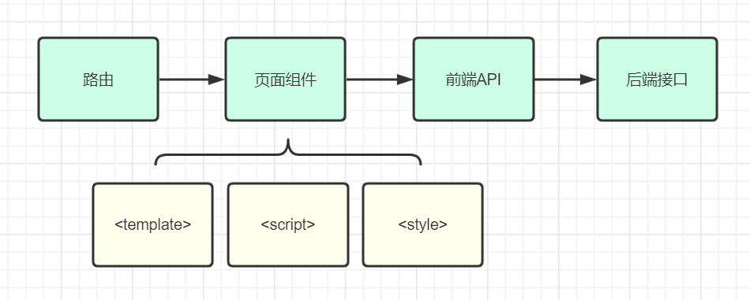

# 01-搭建 Srb 管理平台前端


## 一、vue-element-admin


vue-element-admin 是基于 element-ui 的一套后台管理系统集成方案。

**GitHub地址：**https://github.com/PanJiaChen/vue-element-admin

**项目在线预览：**[https://panjiachen.gitee.io/vue-element-admin](https://panjiachen.gitee.io/vue-element-admin/#/login?redirect=%2Fdashboard)


## 二、vue-admin-template


### 1、简介

**vue-Admin-template** 是基于 vue-element-admin 的一套后台管理系统**基础模板**（最少精简版），可作为模板进行二次开发。

**GitHub地址：**https://github.com/PanJiaChen/vue-admin-template

**根据用户角色来动态生成侧边栏的分支：**https://github.com/PanJiaChen/vue-admin-template/tree/permission-control


### 2. 安装和运行

```bash
# 解压压缩包vue-admin-template-permission-control.zip
# 重命名为srb-admin
# 进入目录
cd srb-admin

# 安装依赖
npm install --registry=https://registry.npm.taobao.org

# 启动。执行后，浏览器自动弹出并访问http://localhost:9528/
npm run dev
```


### 3. 运行结果


## 三、前端小配置


### 1. 修改页面标题

**src/settings.js** 第3行

```json
 title: '尚融宝管理平台',
```


### 2. 国际化设置

**src/main.js** 第7行

```js
import locale from 'element-ui/lib/locale/lang/zh-CN' // lang i18n
```


### 3. 修改导航功能

**src/layout/components/Navbar.vue**

```html
<el-dropdown-menu slot="dropdown" class="user-dropdown">
    <router-link to="/">
        <el-dropdown-item>
            首页
        </el-dropdown-item>
    </router-link>
    <a target="_blank" href="https://github.com/PanJiaChen/vue-admin-template/">
        <el-dropdown-item>Github</el-dropdown-item>
    </a>
    <a target="_blank" href="https://panjiachen.github.io/vue-element-admin-site/#/">
        <el-dropdown-item>Docs</el-dropdown-item>
    </a>
    <el-dropdown-item divided @click.native="logout">
        <span style="display:block;">登出</span>
    </el-dropdown-item>
</el-dropdown-menu>
```


### 4. 修改登录页面

**src/views/login/index.vue** 44 行

```html
<el-button :loading="loading" type="primary" style="width:100%;margin-bottom:30px;" @click.native.prevent="handleLogin">登录</el-button>
```


# 02-Srb 前端路由配置


## 一、路由定义

在 **src/router/index.js** 中，增加积分等级管理的路由配置，找到 **constantRoutes**， 新增一个路由

```json
{
    path: "/core/integral-grade",
    component: Layout,
    redirect: "/core/integral-grade/list",
    name: "coreIntegralGrade",
    meta: { title: "积分等级管理", icon: "el-icon-s-marketing" },
    alwaysShow: true,
    children: [
        {
            path: "list",
            name: "list",
            component: () => import("@/views/core/integral-grade/list"),
            meta: { title: "积分等级列表" },
        },
        {
            path: "create",
            name: "create",
            component: () => import("@/views/core/integral-grade/form"),
            meta: { title: "新增积分等级" },
        },
    ],
},
```


## 二、组件定义


### 1. 创建文件夹

在 **src/views** 文件夹下创建以下文件夹和文件


### 2. core/integral-grade/list.vue

```html
<template>
    <div>积分等级列表</div>
</template>
```


### 3. core/integral-grade/form.vue

```html
<template>
    <div>积分等级表单</div>
</template>
```


## 三、禁用ESLint语法检查


### 1. 报错

在写完上面的代码后，控制台会报一个小错误


这是由于语法检查太严格导致的。


### 2. 解决

**vue.config.js** 第30行处禁用 ESLint 语法检查

```json
lintOnSave: false,
```


# 03-前端项目开发流程


## 一、全栈开发流程

下图是开发过程中涉及到和几个核心的模块，我们已经完成了路由的配置和页面组件的创建，接下来我们需要进一步完善页面组件的模板 \<template> 部分，以及脚本 \<script> 等部分的开发，然后创建前后端对接需要的api模块，最后通过 api 模块向后端接口发起调用。




## 二、前端组件开发


### 1. 定义页面组件模板

修改 **src/views/core/integral-grade/list.vue**

```html
<template>
  <div class="app-container">
    <!-- 表格 -->
    <el-table :data="list" border stripe>
      <el-table-column type="index" width="50" />
      <el-table-column prop="borrowAmount" label="借款额度" />
      <el-table-column prop="integralStart" label="积分区间开始" />
      <el-table-column prop="integralEnd" label="积分区间结束" />
    </el-table>
  </div>
</template>
```


### 2. 定义 api 模块

创建文件 **src/api/core/integral-grade.js**

```js
import request from "@/utils/request";

export default {
  list() {
    return request({
      url: "http://localhost:8110/admin/core/integralGrade/list",
      method: "get",
    });
  }
}
```


### 3. 定义页面组件脚本

**src/views/core/integral-grade/list.vue**

```html
<script>
import intergralGradeApi from '@/api/core/integral-grade'

export default {
    // 定义数据模型
    data () {
        return {
            list : [] // 数据列表
        }
    },

    methods : {
        fetchData() {
            intergralGradeApi.list().then(res => {
                console.log(res);
            })
        }
    },

    created() {
        this.fetchData()
    }

}
</script>
```


### 4、axios响应拦截器修改

上面的代码写完**运行结果**


这是因为 **src/utils/request.js** 里面 **响应拦截的问题**

我们需要将 **src/utils/request.js** 中 将第49行

```js
    if (res.code !== 20000) {
```

更改为：

```js
  if (res.code !== 20000 && res.code != 0) { // 因为我们后台返回的 code 是 0
```

再次查看页面


# 04-配置全局 url


## 一、全局 url

文件 **.env.development** 配置了全局 url


默认的全局 url 是 **localhost:9528/dev/api**

我们需要修改成我们的后端接口地址：

```tex
VUE_APP_BASE_API = 'http://localhost:8110'
```

修改 **src/api/core/integral-grade.js** 

```js
import request from "@/utils/request";

export default {
  list() {
    return request({
      url: "/admin/core/integralGrade/list",
      method: "get",
    });
  }
}
```


## 二、mock-server

**VUE_APP_BASE_API** 的修改会影响到平台模拟登录功能的 mock 数据，因此需要修改 mock-server 的地址

修改 **mock/mock-server.js** 文件 第37行

```js
url: new RegExp(`/dev-api${url}`),
```

修改 **src/api/user.js** 中的接口调用，为每一个远程调用添加配置

```js
baseURL: '/dev-api',
```


## 三、Nginx 反向代理

为了能够**让前端程序能够同时对接多个后端服务**，我们可以使用多种解决方案，例如 nginx 反向代理、微服务网关等。这里我们先使用nginx 作为前后端中间的反向代理层


nginx的 反向代理配置

```nginx
server {
    listen       80;
    server_name  localhost;

    location ~ /core/ {           
        proxy_pass http://localhost:8110;
    }
    location ~ /sms/ {           
        proxy_pass http://localhost:8120;
    }
    location ~ /oss/ {           
        proxy_pass http://localhost:8130;
    }
}
```

nginx的命令

```bash
start nginx #启动
nginx -s stop #停止
nginx -s reload #重新加载配置
```

修改  **.env.development**

```tex
VUE_APP_BASE_API = 'http://localhost'
```


# 05-完善积分等级模块


## 一、删除积分等级

### 1. 页面模板

**src/views/core/integral-grade/list.vue**，在table组件中添加 **删除列**

```html
<el-table-column label="操作" width="200" align="center">
    <template slot-scope="scope">
        <el-button type="danger" size="mini" icon="el-icon-delete" @click="removeById(scope.row.id)">
            删除
        </el-button>
    </template>
</el-table-column>
```


### 2. Js

在 **list.vue** 中增加 删除数据的 js 

```js
removeById(id) {
    this.$confirm('此操作将永久删除该记录, 是否继续?', '提示', {
        confirmButtonText: '确定',
        cancelButtonText: '取消',
        type: 'warning'
    })
        .then(() => {
        // 确认删除
        intergralGradeApi.removeById(id).then(res => {
            this.$message.success(res.message)
            this.fetchData()
        })
    })
        .catch( error => {
        this.$message.info("取消删除")
    })
}
```


### 3. api

在 **src/api/core/integral-grade.js** 中添加一个方法

```js
removeById(id) {
    return request({
        url: `/admin/core/integralGrade/remove/${id}`,
        method: 'delete'
    });
```


## 二、增加积分等级

### 1. 页面模板

**src/views/core/integral-grade/form.vue**，完善 template

```html
<template>
  <div class="app-container">
    <!-- 输入表单 -->
    <el-form label-width="120px">
      <el-form-item label="借款额度">
        <el-input-number v-model="integralGrade.borrowAmount" :min="0" />
      </el-form-item>
      <el-form-item label="积分区间开始">
        <el-input-number v-model="integralGrade.integralStart" :min="0" />
      </el-form-item>
      <el-form-item label="积分区间结束">
        <el-input-number v-model="integralGrade.integralEnd" :min="0" />
      </el-form-item>
      <el-form-item>
        <el-button :disabled="saveBtnDisabled" type="primary" @click="saveOrUpdate()" >
          保存
        </el-button>
      </el-form-item>
    </el-form>
  </div>
</template>
```


### 2. 定义页面 data

```html
<script>
export default {
    // 定义数据模型
    data() {
        return {
            integralGrade : {},
            saveBtnDisabled: false
        }
    }
}
</script>
```


### 3. js

添加 增加积分等级的 js，引入 api

```js
import integralGradeApi from '@/api/core/integral-grade'
```

定义增加方法

```js
// 新增数据
saveData() {
    intergralGradeApi.save(this.integralGrade).then(res => {
        this.$message.success(res.message)
    })
    // 跳转到查询积分等级列表的路由
    this.$router.push('/core/integral-grade/list')
}
```


### 4. api

在 **src/api/core/integral-grade.js** 中添加 新增数据 方法

```js
save(integralGrade) {
    return request({
        url: `/admin/core/integralGrade/save`,
        method: 'post',
        data: integralGrade
    })
}
```


## 三、回显数据

### 1. 路由

在 **src/router/index.js** 中 增加一个子路由

```js
{
    path: "edit/:id", // 路由传参也就是路径变量
    name: "edit",
    component: () => import("@/views/core/integral-grade/form"),
    meta: { title: "编辑积分等级", icon: "el-icon-circle-plus" },
    hidden:true
}
```


### 2. 页面模板

**src/views/core/integral-grade/list.vue**，表格“操作”列中**增加 “修改”按钮**

```html
<router-link :to="'/core/integral-grade/edit/' + scope.row.id" style="margin-right: 5px">
    <el-button type="primary" size="mini" icon="el-icon-edit">
        修改
    </el-button>
</router-link>
```


### 3.Js

**src/views/core/integral-grade/form.vue**，methods 中定义回显方法

```js
// 根据id查询记录
fetchDataById(id) {
    integralGradeApi.getById(id).then(res => {
        this.integralGrade = res.data.integralGrade
    })
}
```

因为已在路由中定义如下内容：**path: 'edit/:id'**，因此可以使用 **this.$route.params.id** 获取路由中的id

```js
created() {
    let id = this.$route.params.id
    if(id) {
        this.fetchDataById(id)
    }
}
```


### 4. api

在 **src/api/core/integral-grade.js** 中添加 回显数据 方法

```js
getById(id) {
    return request({
        url: `/admin/core/integralGrade/get/${id}`,
        method: 'get'
    })
}
```


## 四、更新数据

### 1. Js

**src/views/core/integral-grade/form.vue**，methods 中定义 更新方法

```js
updateData() {
    integralGradeApi.updateById(this.integralGrade).then(res => {
        this.$message.success(res.message)
        this.$router.push('/core/integral-grade/list')
    })
}
```

完善 **saveOrUpdate()** 方法

```js
saveOrUpdate() {
    this.saveBtnDisabled = true
    if (this.integralGrade.id) {
        this.updateData()
    }else {
        this.saveData()
    }
}
```


### 2. api

在 **src/api/core/integral-grade.js** 中添加 更新数据 方法

```js
updateById(integralGrade) {
    return request({
        url: `/admin/core/integralGrade/update`,
        method: 'put',
        data: integralGrade
    })
}
```

